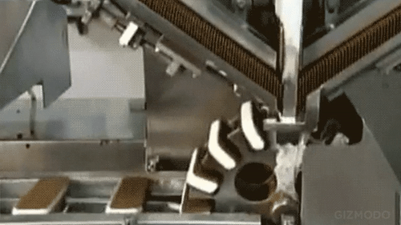

class:inverse

```{r setup, include=FALSE}
options(htmltools.dir.version = FALSE)

library(tidyverse)

gas <- forecast::gas

# nice plotting them
theme_black = function(base_size = 12, base_family = "") {
 
  theme_grey(base_size = base_size, base_family = base_family) %+replace%
 
    theme(
      # Specify axis options
      axis.line = element_blank(),  
      axis.text.x = element_text(size = base_size*0.8, color = "white", lineheight = 0.9),  
      axis.text.y = element_text(size = base_size*0.8, color = "white", lineheight = 0.9),  
      axis.ticks = element_line(color = "white", size  =  0.2),  
      axis.title.x = element_text(size = base_size, color = "white", margin = margin(0, 10, 0, 0)),  
      axis.title.y = element_text(size = base_size, color = "white", angle = 90, margin = margin(0, 10, 0, 0)),  
      axis.ticks.length = unit(0.3, "lines"),   
      # Specify legend options
      legend.background = element_rect(color = NA, fill = "#282823"),  
      legend.key = element_rect(color = "white",  fill = "#282823"),  
      legend.key.size = unit(1.2, "lines"),  
      legend.key.height = NULL,  
      legend.key.width = NULL,      
      legend.text = element_text(size = base_size*0.8, color = "white"),  
      legend.title = element_text(size = base_size*0.8, face = "bold", hjust = 0, color = "white"),  
      legend.position = "right",  
      legend.text.align = NULL,  
      legend.title.align = NULL,  
      legend.direction = "vertical",  
      legend.box = NULL, 
      # Specify panel options
      panel.background = element_rect(fill = "#282823", color  =  NA),  
      panel.border = element_rect(fill = NA, color = "white"),  
      panel.grid.major = element_line(color = "grey35"),  
      panel.grid.minor = element_line(color = "grey20"),  
      panel.spacing = unit(0.5, "lines"),   
      # Specify facetting options
      strip.background = element_rect(fill = "grey30", color = "grey10"),  
      strip.text.x = element_text(size = base_size*0.8, color = "white"),  
      strip.text.y = element_text(size = base_size*0.8, color = "white",angle = -90),  
      # Specify plot options
      plot.background = element_rect(color = "#282823", fill = "#282823"),  
      plot.title = element_text(size = base_size*1.2, color = "white"),  
      plot.margin = unit(rep(1, 4), "lines")
 
    )
 
}

theme_set(theme_black ())
ow <- "#f8f8f8"
```


# Contents

- What is a time series (and ts objects)
- Working with dates and times
- Using Rolling/Moving Averages
- binning (hourly, daily, weekly, monthly, qrtrly, annually, etc) ie annualise 
- Using seasonal adjustment / trend (like in ABS series)




---

class: inverse

# What is a time series

Simply looking at a observations *evenly spaced*, with an associated date, time or date-time stamp.

An example: *Australian monthly gas production: 1956–1995*
```{r}

head(gas, 50)

```


---

class: inverse

# What is a time series


```{r, fig.height=5, fig.width=11}
plot(gas)
```

---

class: inverse

# TS objects

This type of data has been traditionally stored as `ts` objects. But they are a pain to work with...

```{r, fig.height=2, fig.width=11}
class(gas)

try(colnames(gas))

try(ggplot(gas))
```


---
class: inverse

# TS objects

So thank full someone has made some tools to easily conver to data frames (well, `tibbles`, becuase they are nicer to use)

```{r}
library(timetk)
gas <- tk_tbl(gas)
head(gas, 4)
```

.footnote[
The `ts` class object is required for some functions (such as `Arima()` and `bats()` for forecasting). A call like `tk_ts()` can convert back to a `ts` object.
]

---
class: inverse

# TS objects

So now we can do our more familar operations and manipulate the date stamp more easily
```{r}
library(lubridate)
gas %>% 
  mutate(year = year(index),
         month = month(index),
         month.abr = month(index, label = T),
         date = date(index),
         value.sq = sqrt(value)) %>% 
  head()

```

---
class: inverse

# TS objects
```{r, fig.height=3, fig.width=11}
ggplot(gas, aes(index, value)) +
  geom_line(col = ow) + 
  geom_point(col = ow)
```

.footnote[
Note: Even here this `index` datestamp value is not prefered
]

---

class: inverse

# TS objects

Say we want to build time series (ts) but have missing data.

```{r, fig.height=3, fig.width=11}
gas <- gas %>% 
  mutate(index = date(index))

df <- gas[c(1:300, 320:400),]

ggplot(df, aes(index, value)) +
  geom_line(col = ow) + 
  geom_point(col = ow)
```

---

class: inverse

# TS objects

We can use the `padr` package to convert to a proper ts structure.

```{r, fig.height=2, fig.width=11}
library(padr)

df_fill <- df %>% 
  pad() %>% 
  fill_by_value(value, value = 0) # first arg being the variable we want to fill

ggplot(df_fill,  aes(index, value)) +
  geom_line(col = ow) + 
  geom_point(col = ow)

```


---

class: inverse

# TS objects
Is not a time series
```{r, fig.height=2, fig.width=11, echo=F}

ggplot(df, aes(index, value, col = value)) +
  geom_line(col = ow) +
  geom_point(col = ow)

```
Is a time series
```{r, fig.height=2, fig.width=11, echo=F}

ggplot(df_fill, aes(index, value, col = value)) +
  geom_line(col = ow) +
  geom_point(col = ow) 
```
Is an interpolated time series
```{r, fig.height=2, fig.width=11, echo=F, warning=F, message=F}
df_int <- df %>% 
  pad() %>% 
  mutate(value2 = approx(value, n = 400)[[2]])

ggplot(df_int, aes(index, value2, col = value2)) +
  geom_line(col = ow) +
  geom_point(col = ow)
```


---


class: inverse

# Moving Averages

```{r}

library(TTR) # some guys tools package with the fastest simple moving average

gas_g <- gas %>% 
  mutate(sma.10 = SMA(value),
         sma.100 = SMA(value, n = 100),
         ema.10 = EMA(value)) %>% 
  gather(key, val, -index)
```


- SMA: simply moving average (arithmetic mean)
  - with two window sizes
  
- EMA: exponentially-weighted mean, giving more weight to recent observations

---

class: inverse

# Moving Averages

```{r, fig.height=6, fig.width=11, warning=F}

ggplot(gas_g, aes(index, val, col = key)) +
  geom_line(size = 1)
```


---

class: inverse

# Binning

Rather than just smoothing a ts we might want to bin it to a particular interval. Our gas data is monthly but perhaps we want quarterly or annually?

The `lubridate` package has some great functions to help minipulate datetime stamps such as:

```{r, eval=F}
quarter(x, with_year = T)

floor_date(x, unit = c(
  "minute", 
  "month", 
  "week", 
  "hour",
  "year",
  "halfyear",
  "season",
  "bimonth"
))
```


---
class: inverse

# Binning

To get a quarterly time series:

```{r}
gas_qrtr <- gas %>% 
  mutate(index = quarter(index, with_year = T)) %>% 
  group_by(index) %>% 
  summarise(value = mean(value))

gas_qrtr %>% 
  pull(index) %>% 
  head()

```

---
class: inverse

# Binning

```{r, fig.height=6, fig.width=11, warning=F}
ggplot(gas_qrtr, aes(index, value)) +
  geom_line(col = ow) +
  geom_point(col = ow)
```


---
class: inverse

# Binning

To get an annual time series:

```{r, fig.height=6, fig.width=11, warning=F}

gas_annual <- gas %>% 
  mutate(index = floor_date(index, unit = "year")) %>% 
  group_by(index) %>% 
  summarise(value = mean(value))

gas_annual %>% 
  pull(index) %>% 
  head()

```

.footnote[
Note: the `floor_date()` method, retains the index's datetime format, where as the `quarter()` (or `year()`) function would drop to just a date format.
]

---
class: inverse

# Binning

```{r, fig.height=4, fig.width=11, warning=F}
ggplot(gas_annual, aes(index, value)) +
  geom_line(col = ow) +
  geom_point(col = ow) +
  scale_x_date(name = NULL, 
               breaks = pull(gas_annual, index),
               labels = scales::date_format("%Y")) +
  theme(axis.text.x = element_text(angle = 45, hjust = 1))
```

---
class: inverse

# Seasonal Adjustment

This is actaully a complex and imprecise science (a bit like forecasting) as has many mehtods.

The ABS explains on its website that it uses methods devised by the US Census Bureau, some of which are ported to R. They are complex, archaic and tricky to use. But it we want to replicate exactly the series that that ABS produces I'm happy to follow it up.

In the mean time here is a method that gets close. It's here in a raw crude form but it could be function-ified.

.footnote[
Notes:
[ABS Seasonaly Adj methods](http://www.abs.gov.au/websitedbs/d3310114.nsf/4a256353001af3ed4b2562bb00121564/c890aa8e65957397ca256ce10018c9d8!OpenDocument)

[Example of R package: x12](https://cran.r-project.org/web/packages/x12/)
]

---
class: inverse

# Seasonal Adjustment

Using _ABS 6202.0 Labour Force_ as an example:

```{r, echo=F}
library(tidyverse)
library(lubridate)

library(readxl)

library(timetk)
library(sweep)


lab_force_df <- read_xls("extdata/6202001.xls", sheet = 2) %>% 
  select(X__1, `Employed total ;  Persons ;__2`, `Employed total ;  Persons ;__1`) %>% 
  `colnames<-`(c("index", "total.lb.frc.original", "total.lb.frc.seasadj")) %>% 
  tail(nrow(.) - 9) %>% 
  mutate(index = as.POSIXct(as.numeric(index) * (60*60*24), origin="1899-12-30", format="%Y-%m-%d", tz="GMT"),
         index = floor_date(index, "month")) %>% 
  mutate_at(vars(total.lb.frc.original, total.lb.frc.seasadj), as.numeric)
```

```{r, fig.height=5, fig.width=11, warning=F}

lab_force_df %>% 
  gather(key, val, -index) %>% 
  ggplot(aes(index, val, col = key)) +
  geom_line()

```

---
class: inverse

# Seasonal Adjustment


```{r, fig.height=5, fig.width=11, warning=F}

lab_force_df %>% 
  tail(100) %>% 
  gather(key, val, -index) %>% 
  ggplot(aes(index, val, col = key)) +
  geom_line()

```

---
class: inverse

# Seasonal Adjustment
Crude code to test multiple `STL` window lengths:
```{r}
# convert to ts
lab_force_ts <- lab_force_df %>%
  pull(total.lb.frc.original) %>% 
  ts(start = c(1978,2), frequency = 12)
# run a few options through stl
seasadj_compare_df <- tibble(params = list(7, 9, 11, 13)) %>% 
  mutate(stl = map(params, ~ stl(lab_force_ts, s.window = .x)),
         stl = map(stl, sw_tidy_decomp),
         stl = map(stl, select, seasadj),
         stl = map(stl, mutate, index = lab_force_df$index)) %>% 
  mutate(params = as.character(params)) %>% 
  unnest(stl) %>% 
  bind_rows(
    lab_force_df %>% 
      select(index, total.lb.frc.seasadj) %>%
      rename(seasadj = total.lb.frc.seasadj) %>% 
      mutate(params = "abs")
  ) %>% 
  spread(params, seasadj) %>% 
  tail(40) %>% 
  gather(params, seasadj, -index)
```

---
class: inverse

# Seasonal Adjustment

```{r, fig.height=6, fig.width=11, warning=F, dpi = 200}
ggplot(seasadj_compare_df, aes(index, seasadj, col = params)) +
  geom_line(size = 2, alpha = 0.6)
```

